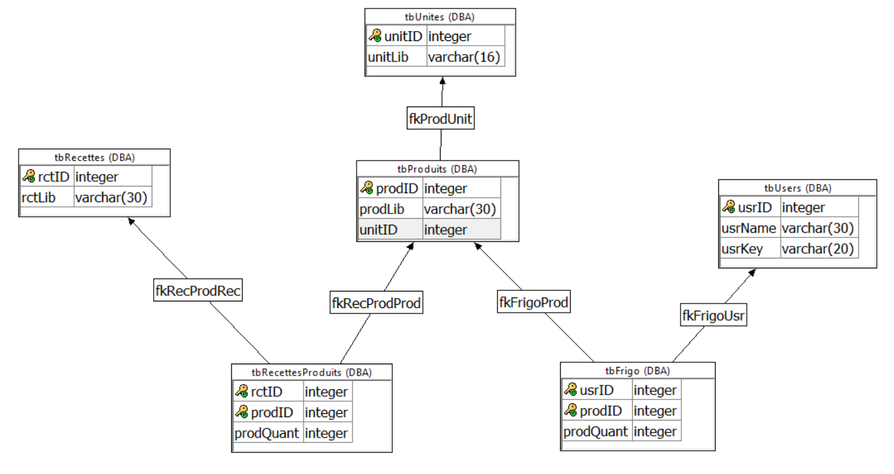

# Virtual-Fridge

Projet de fin d'année 1TL2, cours de "structures et données".
 
<h2>Objectif:</h2>
 
Faire l’inventaire des aliments et les stocker dans un espace virtuel, et avoir acces a une liste de recettes pouvant être réalisées avec ces aliments.
<h2>Fonctionnalités principales:</h2>
 
<ol>
<li>Ajotuer et retirer des aliments au frigo.</li>
<li>Vérifier les quantités.</li>
<li>Montrer une liste de recette qui pourraient être réalisées avec des ingrédients se trouvant dans le frigo.</li>
<li>Rajouter a la liste des aliments disponible une nouvelle entrée</li>
</ol>
<h2>Fonctionnalités secondaires:</h2>
 
Le site propose un systeme de login/register simpliste qui permet de sauvegarder les contenus d'un "frigo"
<h2>Membres</h2>
 
<ul>
<li>Delannoit Grégoire</li>
<li>Beaufils Liam</li>
<li>Wets Florian</li>
<li>Schampaert Sebaztyan</li>
</ul>
 
<h2>Tables</h2>

<ul>
	<li><strong>tbRecettes: </strong>Contient un identifiant, qui sert de Primary Key, et un libellé pour les recettes. </li>
	<li><strong>tbProduits: </strong>Contient une liste des produits, de leurs identifiants qui servent de Primary Key, et des identifiants des unités qui, en tant que Foreign Key, permettent le lien vers la table des unités.</li>
	<li><strong>tbRecettesProduits: </strong>Lien entre les recettes et les produits via les identifiants recettes et les identifiants produits qui servent de Primary Key ET de Foreign Key, ainsi que la quantité, en fonction de leur unité, nécessaire.</li>
	<li><strong>tbUsers: </strong>Contient les identifiant servant de Primary Key, les noms et les mots de passe.</li>
	<li><strong>tbFrigo: </strong>Met en lien le User avec les produits qu'il possède via leurs identifiants qui servent de Primary Key ET de Foreign Key, ainsi que leur quantité.</li>
	<li><strong>tbUnites: </strong>Table des unités, nécessaire pour clairement donner les informations nécessaire. Comme leur ID qui servent de Primary Key, ainsi que leur libellé.</li>
</ul>
 
<h2>Webservices</h2>
 
<h3>ajouterProduit :</h3>
INPUT produit VARCHAR(30), unite VARCHAR(30)
Insère un nouveau "produit" et son unité de mesure dans la table des produits, son ID est automatiquement incrementé, ne renvoie rien.
<h3>getProduit :</h3>
Pas d’input et de paramètres. RESULT id int, lib varchar(20), libUnit varchar(10) après avoir été les chercher dans tbProduits et les affiches au client en JSON.
<h3>getUserId :</h3>
INPUT @username varchar(30). Renvoie l’ID de l’utilisateur correspondant pour accéder à son propre frigo, RETURN userID int.
<h3>listUsers :</h3>
Pas d’input et de paramètres. RESULT (username char(30), pswd char(30)). Selectionne usrName, usrKey dans le tableau tbUsers puis renvoie les renvoient au user en JSON.
<h3>recupererFrigo :</h3>
INPUT @userID int. RESULT lib varchar(16), quant int, libUnit varchar(10). Selectionne prodLib, prodQuant, unitLib dans le tbFrigo et les renvoie au user en JSON.
<h3>register :</h3>
INPUT @username varchar(30), @password varchar(30). RESULT userID int. Insere un nouveau « nom d’utilisateur » et un mot de passe joint à lui dans le tbUsers. Son ID est automatiquement incrementé.
<h3>resetFrigo :</h3>
INPUT @userID int. Supprime les données du frigo du user par un DELETE FROM tbFrigo. Ne renvoie rien.
<h3>ajouterFrigo :</h3>
INPUT @produits int, @quantite int, @userID int. Ajoute une colonne à la table des frigos et la met à jour si elle existe déjà au moyen d’un UPDATE. Contient un conditionnel et fait appel à la fonction testFrigo.  Ne renvoie rien.
